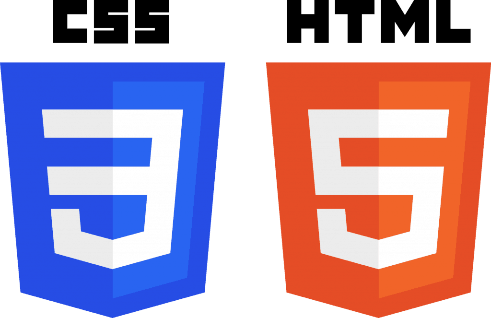
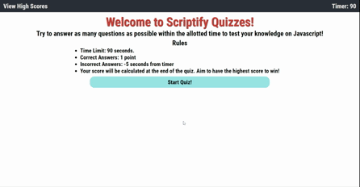

# Scriptify Quizzes
## Summary
### This application is a coding challenge that's a part of the University of Central Florida's coding bootcamp. It's intended that this application will test my knowledge of Web API's as well as all information previously covered within this course. For this challenge I aim to create a website that generates a quiz on Javascript basics. 

# Methodologies

# Functionality
